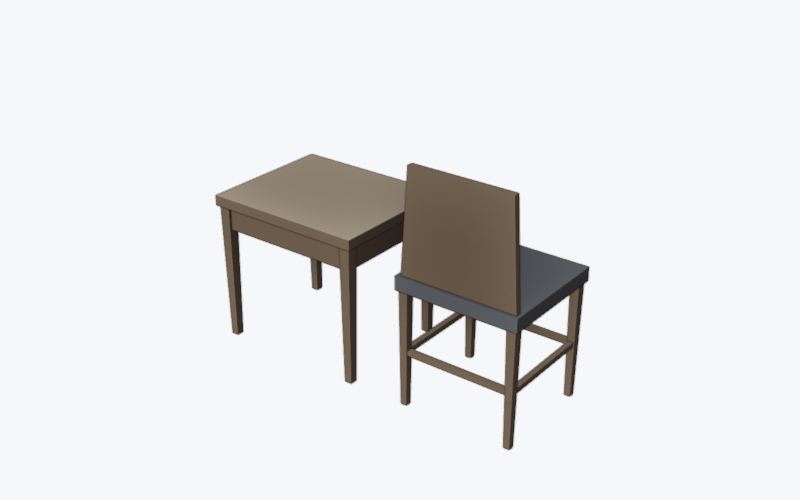
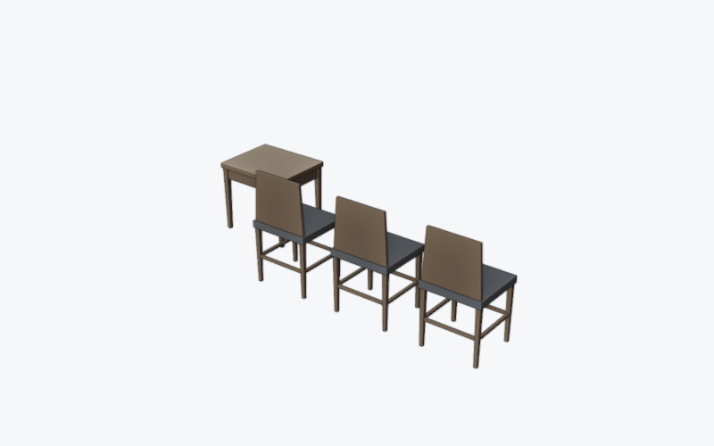

# skptool

[Deutsch](README.md) | **English**

**Read SketchUp files (`.skp`), convert them to open formats, edit them in Blender and save them back as `.skp`, without SketchUp and without the Trimble SDK.**

`skptool` is a command-line tool built on [OpenSKP](https://github.com/iamahsanmehmood/openskp), an MIT-licensed, reverse-engineered reader and writer for `.skp`, and uses [Blender](https://www.blender.org) as its editor. It reads files from SketchUp 2013 through 2026. The research into all the alternatives is in [RECHERCHE.md](RECHERCHE.md) (German).

> SketchUp is a trademark of Trimble Inc. This project is not affiliated with Trimble and is neither endorsed nor reviewed by Trimble.

**Language note:** the program itself speaks German. Help texts, progress and error messages, the field names in `report` output and a few option names (for example `--geometrie`, `--nur-lesen`) are German. This README explains every option in English.

| SketchUp sample, loaded into Blender with `skptool` | Edited (two chairs added, table moved) and saved back as `.skp` |
|---|---|
|  |  |

## What it does

- **Converts** `.skp` to glTF, OBJ, STL, PLY, DXF, IFC, JSON, `.blend`, FBX, USD, Alembic and PNG, and from the common Blender formats (`.blend`, glTF, FBX, OBJ, STL, PLY, USD, Alembic) back to `.skp`.
- **Round trip through Blender:** Components, nested Groups, Tags, per-face Materials, Textures (front and back, with placement and Colorize), Opacity and hard and soft edges are all preserved.
- **Command-based editing** with a fixed set of operations (move, rotate, scale, paint, copy, delete, ...), no Blender knowledge required.
- **Live editing** in a running Blender window: commands take effect immediately, and every save writes the `.skp` automatically. Designed for scripts and AI assistants as well.
- **MCP server** for AI assistants such as Claude: `skptool mcp` exposes reading, comparing, converting, editing and live control as tools.
- **Blender extension:** SketchUp right in Blender's File > Import and File > Export menus.
- **3MF for 3D printing**, directly, without Blender.
- **Rewrites newer files in the 2017 format** so that older programs can open them, including Text, Dimensions and attributes.
- **Built for untrusted files:** no code execution, no network access, no foreign local files in the output. Details in [SECURITY.en.md](SECURITY.en.md).

## How it compares

Individual pieces exist elsewhere. What, as far as our research shows (September 2026), only `skptool` combines as an open tool: editing an existing `.skp` in Blender or through an AI assistant and saving it back as `.skp` **with its structure**, without SketchUp, without the Trimble SDK and without an account.

| | read `.skp` | write `.skp` | structure back (Components, nesting, Tags) | textures back | AI control | without SketchUp and SDK |
|---|---|---|---|---|---|---|
| [OpenSKP](https://github.com/iamahsanmehmood/openskp) (library, the foundation of `skptool`) | yes | yes (2017) | as a library, build it yourself | as a library | no | yes |
| [blender-openskp](https://github.com/iamahsanmehmood/blender-openskp) (Blender add-on) | yes | yes | Tags yes, geometry flattened and triangulated | no, solid color only | no | yes |
| [RedHalo Sketchup_Importer](https://github.com/RedHaloStudio/Sketchup_Importer) (Blender add-on) | yes | no | | | no | no, Trimble SDK, no Linux |
| [Blender MCP](https://github.com/ahujasid/blender-mcp) and the Blender connector for Claude | only through an add-on | no | | | yes, in Blender | |
| SketchUp connector for Claude (Trimble) | | creates new models | | | yes | no, SketchUp account |
| **`skptool`** | yes (2013 to 2026) | yes (2017) | yes, including hard and soft edges and back faces | yes, with placement and Colorize | yes: live mode and MCP | yes |

On top of that come things a command line offers and add-ons do not: batch conversion, `diff`, `report` and 3MF with colors for 3D printing. `skptool` would not exist without OpenSKP; the table compares tools, not their quality, and reflects what the projects state, not our own tests (except for `skptool`). More in [RECHERCHE.md](RECHERCHE.md) (German).

## Installation

Requirements: **Python 3.12 or newer** and **Blender** (tested with 5.2 LTS; versions from 4.2 on should work but are untested). Blender is only needed for the Blender formats, preview images and the way back to `.skp`. Developed and tested on Windows. On Linux, all tests run in CI, including with Blender, plus a check with real files in Docker. On macOS, only the tests without Blender run in CI; otherwise it is untested.

### Install as a command (recommended)

With [pipx](https://pipx.pypa.io) or [uv](https://docs.astral.sh/uv/), each into its own isolated environment:

```bash
pipx install git+https://github.com/nexos-1/skptool
```

```bash
uv tool install git+https://github.com/nexos-1/skptool
```

After that, `skptool` works in every folder (`skptool --version`). Update with `pipx upgrade skptool` or `uv tool upgrade skptool`, remove with `pipx uninstall skptool` or `uv tool uninstall skptool`. The dependencies are pinned to fixed versions. If you also want checksums for every package, install from `requirements.lock` as shown below. Not on PyPI yet.

### From the project folder (with checksums)

```bash
python -m venv .venv
```

```bash
.venv\Scripts\python -m pip install --require-hashes --no-deps -r requirements.lock
```

`requirements.lock` pins a checksum for every package, so nothing can be swapped in during installation. On macOS and Linux the path is `.venv/bin/python`.

On Windows, run the tool through `skptool.cmd` in the project folder. To make `skptool` work from any folder without changing the PATH:

```bash
.venv\Scripts\python tools\aufruf_einrichten.py --ja
```

This creates a small launcher in `%USERPROFILE%\.local\bin` (on macOS and Linux `~/.local/bin/skptool`). That folder is usually on the PATH already, for example through uv. Without `--ja` ("yes") the script only shows what it would do. `--ziel` ("target") picks a different folder, `--entfernen --ja` ("remove") deletes the launcher again, and files that the script did not create are never overwritten. Then open a new terminal and try `skptool --version`.

Blender is found in the usual installation folders; otherwise set `SKPTOOL_BLENDER` to its path or pass `--blender`. Blender is never started from the current folder.

## Commands

```bash
skptool info house.skp
```

Version, dimensions, Tags, Materials and Components. `--json` for machine-readable output, `--all` for complete lists, `--fast` to skip the dimensions.

```bash
skptool convert house.skp -o house.blend
```

The extension of the target file selects the format. Batch mode with a pattern, a format and a target folder:

```bash
skptool convert "projects\*.skp" -f glb -d export
```

As soon as more than one file is converted, `skptool` overwrites existing target files only with `--force`. If the pattern matches a single file, the target is overwritten without asking, just as with `-o`. With `--jobs auto` (or `--jobs N`) several files are converted at once, each in its own process. A memory guard estimates the need of each file (roughly 100 times the file size, plus 0.5 GB with Blender) and only starts as many processes as fit into 70 percent of the free RAM; large files run alone. Ctrl+C stops all processes, including Blender. This pays off from about one second per file (Blender targets, larger models); many tiny files converted to `.glb` are faster one after another.

```bash
skptool open house.skp
```

Creates `house.blend` (different name with `-o`) and opens Blender. `skptool` first names the file it creates. If `house.blend` already exists and is newer than `house.skp`, `open` stops instead of overwriting changes made in Blender: open it with `skptool open house.blend`, or recreate it with `--force`. All checks run before any file is written. After editing and saving, convert back with `skptool convert house.blend -o house_edited.skp`. An existing `.blend` is checked in the background before it is opened, because Blender's window loads everything the file refers to: network paths are rejected, external files are only allowed with `--allow-external`.

```bash
skptool render house.skp -o preview.png
```

Renders a preview image without opening a window.

```bash
skptool report "projects\*.skp"
```

Summary report over many files: for each file the version, stored and placed faces, Components, Tags, Materials (textured, colorized, transparent), textures (count, size, longest edge, read from the image header only) and load time, plus warnings about what may get lost in conversion (the kind of tint of colorized textures, Scenes, Section Planes, Text and Dimensions that cannot be transferred, the behavior of Dynamic Components, Text and Dimensions outside of `.skp`, very large files and textures, version 2019 or very old). What gets lost when rewriting to `.skp` is worded exactly as in the message from `convert`. Unreadable files become an error line and the run continues; the exit code is then 1. `--json` returns one document for all files, `--html` a self-contained page without scripts. `--csv` returns a table for Excel and LibreOffice with German regional settings (semicolon, decimal comma, UTF-8 with BOM), `--csv-international` one following RFC 4180 (comma, decimal point) for Excel with English regional settings and for scripts. Names that Excel would read as a formula, number or date start with an apostrophe and stay text. `-o report.html` writes to a file; without a format switch the extension selects the format. `--bounds` also computes the dimensions, and `--rekursiv` ("recursive") makes `"projects\**\*.skp"` search subfolders as well.

```bash
skptool diff house.skp house_edited.skp
```

Compares two `.skp` files: model statistics, Tags, Materials (color, opacity, texture), Components and Groups, and every placement with its position in space ("verschoben um 12 mm", moved by 12 mm; "gedreht oder skaliert", rotated or scaled). Placements are compared top down, each relative to its parent group: if a table was moved, `diff` reports only the table, not every leg in it. Identical parts that merely swapped places count as equal. A missing group is reported as one entry with the number of its parts. Groups are matched by their content, because their numbers change when a file is rewritten. `--geometrie` compares every placed vertex, `--texturen` the texture positions (both need a lot of RAM). `--toleranz` sets the tolerance in mm (default 0.1), `--nur modell,ebenen,materialien,definitionen,platzierungen` limits the comparison to model, Tags, Materials, definitions and placements, `--all` shows everything, `--json` gives machine-readable output, and `-q` only sets the exit code: 0 identical, 1 different, 2 error. Intended for checking a round trip, for example `skptool diff house.skp house_back.skp --geometrie`.

More options: `-v` shows Blender's output and the time of each step, `-q` turns off the progress display. `--no-textures` leaves textures out, `--keep-triangles` keeps triangles instead of merging them into faces on import into Blender, `--unit-scale` sets the meters per Blender unit when writing `.skp` (default 1), and `--width` and `--height` set the size of the preview image (default 1600 x 1000). `--ops` (see below) also works with `convert`, `render` and `open`; the model is then edited before it is written. `.skp` output is read back as a check, by default up to 100 MB (`--verify` always, `--no-verify` never). `--allow-external` takes over local files that an untrusted input refers to (see [Security](#security)).

### Command-based editing

```bash
skptool list house.skp --name "Chair*"
```

Lists objects with Tag, size and Materials. Filters: `--name` (pattern with `*`), `--layer` (Tag), `--material`, `--definition` (all placements of a Component), `--limit` (default 100), `--json`.

```bash
skptool edit house.skp -o house_new.skp --ops changes.json
```

Applies a list of operations and writes the result in any output format. `--ops` accepts a `.json` file, JSON text, or `-` for standard input:

```json
[
  {"op": "move", "select": {"name": "Table"}, "by": [0, 0.5, 0]},
  {"op": "duplicate", "select": {"name": "Chair"}, "offset": [0.7, 0, 0], "count": 2},
  {"op": "set_material", "select": {"name": "Tabletop"}, "material": "Anthracite", "color": [55, 58, 62]},
  {"op": "add_box", "name": "Crate", "size": 0.3, "at": [-1, 0, 0], "layer": "Decor"}
]
```

Operations: `list`, `summary`, `measure`, `move`, `rotate`, `scale`, `mirror`, `align`, `distribute`, `set_material`, `recolor`, `set_layer`, `hide_layer`, `show_layer`, `hide`, `show`, `delete`, `rename`, `duplicate`, `array`, `add_box`. Units are meters and degrees, z points up. `layer` means a SketchUp Tag, which is a Collection in Blender. For `align`, `distribute`, `mirror`, `array` and `measure`, an object's bounding box covers all of its content, like a SketchUp Group. `list`, by contrast, shows the size of an object's own geometry.

```json
[
  {"op": "align", "select": {"name": "Chair*"}, "axis": "y", "to": "max", "to_object": {"name": "Table"}},
  {"op": "distribute", "select": {"name": "Chair*"}, "axis": "x", "gap": 0.2},
  {"op": "array", "select": {"name": "Chair"}, "counts": [3, 2, 1], "spacing": [0.6, 0.5, 0]},
  {"op": "mirror", "select": {"name": "Shelf"}, "axis": "x"},
  {"op": "hide", "select": {"name": "Decor*"}},
  {"op": "measure", "select": {"name": "Table"}, "to_object": {"name": "Sofa"}}
]
```

`align` aligns to the `min`, `center` or `max` of the common bounding box or to a reference object (`to_object`). `distribute` spaces objects evenly by their centers or with a fixed gap (`gap`). `array` creates linked copies in a grid. `mirror` mirrors across the plane through `pivot` (`self`, `group`, `origin` or `[x, y, z]`); the geometry stays shared. `hide` and `show` hide or unhide individual objects together with their content; in the `.skp` the outer Group is then hidden. `measure` changes nothing and reports size, center and distance. The full reference is in [`ops.py`](skptool/blender_scripts/ops.py). No operation runs code or touches files. If one operation fails, nothing is written.

**Windows PowerShell 5.1:** JSON text in quotes (`--ops '[...]'`) arrives broken there, because PowerShell strips the inner double quotes. Use a `.json` file instead, or pipe the file in: `Get-Content changes.json -Raw | skptool edit house.skp -o house_new.skp --ops -`. For non-ASCII characters in names, set `$OutputEncoding = [Text.Encoding]::UTF8` first. PowerShell 7, cmd and Bash are not affected.

### Live in a running Blender

```bash
skptool open house.skp --live
```

Starts Blender with a local connection. Commands take effect immediately in the open window, and each call is a separate step for Undo (Ctrl+Z) (on Windows PowerShell 5.1, pass `--ops` as a file or with `-` as shown above):

```bash
skptool live --ops '[{"op": "move", "select": {"name": "Chair*"}, "by": [0, 0, 1]}]'
skptool live --screenshot image.png
skptool live --save --wait
skptool live --status
skptool live --quit
```

Every save, with Ctrl+S or `live --save`, writes `house_bearbeitet.skp` in the background (the suffix is German for "edited"). If that file already exists, `skptool` requires an explicit `--export-skp house_bearbeitet.skp`. The original is never overwritten. If the file already exists, a live Blender is already running, or the `.blend` is newer than the `.skp`, `skptool` stops before writing anything. `--screenshot` shows the whole model with `--view model` (only the selection with `--select "Chair*"`), the 3D Viewport as currently shown with `viewport`, and the whole window with `window`. `--undo` reverts the last step (`--undo 3` the last three), `--export` writes the `.skp` from the last saved `.blend` without saving again, and `--keep-going` continues after a failed operation. `--quit` closes Blender only if there are no unsaved changes, `--quit --force` closes it anyway. `--json` makes every answer machine-readable. A small command takes about 25 ms, even on a model with 632,000 faces. The connection is only reachable from this computer and protected by mutual authentication.

### For AI assistants (MCP)

```bash
skptool mcp
```

Starts an MCP server (Model Context Protocol) over stdio. Claude Code, Claude Desktop and other MCP clients can then use skptool directly as tools: `skp_info`, `skp_list`, `skp_diff`, `skp_report`, `skp_convert`, `skp_edit`, plus `live_status`, `live_ops`, `live_screenshot` and `live_undo` for a Blender started with `skptool open file.skp --live`.

Claude Code:

```bash
claude mcp add skptool -- "C:\path\to\skptool\skptool.cmd" mcp
```

Claude Desktop (`%APPDATA%\Claude\claude_desktop_config.json`):

```json
{"mcpServers": {"skptool": {
  "command": "C:\\path\\to\\skptool\\.venv\\Scripts\\python.exe",
  "args": ["-P", "-m", "skptool", "mcp"],
  "env": {"PYTHONPATH": "C:\\path\\to\\skptool"}}}}
```

`--nur-lesen` ("read only") offers only the reading tools, `--ordner D:\Projects` ("folder", can be repeated) only allows files inside these folders, and `--timeout SECONDS` limits each call (default 900). Writing tools never overwrite existing files unless explicitly asked to with the `ueberschreiben` ("overwrite") argument, and never overwrite an input. `skp_convert` also writes `.3mf` for 3D printing (only from `.skp`). To test without a client: `.venv\Scripts\python tools\mcp_testclient.py`.

Checked with the official MCP Inspector (CLI) and the official MCP Python SDK, protocol versions 2024-11-05 through 2025-11-25. To repeat the check with the SDK and the JSON schemas of the specification: `.venv\Scripts\python tools\mcp_sdk_pruefung.py` (needs a separate `.venv-mcp` with the SDK; setup instructions are at the top of the script). Claude Code stores tool output over 25,000 tokens in a file (`MAX_MCP_OUTPUT_TOKENS`).

### In Blender: File > Import/Export > SketchUp

The Blender extension `skptool_io` adds SketchUp directly to the File > Import and File > Export menus (Blender 4.2 or newer, tested with 5.2). It contains no OpenSKP; it calls the installed skptool.

```bash
.venv\Scripts\python tools\extension_bauen.py
```

builds `dist\skptool_io-0.1.0.zip` and checks it. In Blender: Edit > Preferences > Get Extensions > Install from Disk. In the extension's preferences, enter the project folder (or its `skptool.cmd`) under "skptool Path"; after installing with pipx or uv, the path of the installed program (on Windows `skptool.exe`). Leaving it empty is enough if `tools\aufruf_einrichten.py --ja` created the launcher.

- **Import** brings Components as linked duplicates, Tags as Collections, Materials, textures and hard edges into the current scene. `.skp` files can also be dragged into the 3D Viewport.
- **Export** writes the scene, or with "Selection Only" the selection including children. "Apply Modifiers" (default) writes the evaluated geometry. The scene unit scale is taken into account.
- Progress is shown in the status bar, Esc cancels. The interface is in English, like Blender.
- By default only embedded data is taken from the scene. Unpacked images and linked libraries only with "Allow External Files", and only for files from a trusted source.

## Formats

| Direction | Formats | Route |
|---|---|---|
| `.skp` to | `.glb` `.obj` `.stl` `.ply` `.dxf` `.ifc` `.json` `.3mf` | directly with OpenSKP, without Blender |
| `.skp` to | `.blend` `.fbx` `.usd` `.usdz` `.abc` `.gltf` `.png` | through Blender in the background |
| to `.skp` | from `.blend` `.glb` `.gltf` `.fbx` `.obj` `.stl` `.ply` `.usd*` `.abc` | through Blender, written as a SketchUp 2017 file |
| `.skp` to `.skp` | any readable version, including 2026 | rebuilt as a SketchUp 2017 file, without Blender |

**3MF for 3D printing** (PrusaSlicer, OrcaSlicer, Bambu Studio): millimeters, z up. Each Component is stored once in the file and its placements refer to it. OrcaSlicer loads the model as one object made of several parts. PrusaSlicer turns each placement into its own object and, for parts that touch, asks whether they should be one object with multiple parts: with "Yes" the parts stay in place. **Colors:** if the model has several colors, each color becomes a filament (at most 16, otherwise similar colors are merged; textures count with their average color). PrusaSlicer gets the colors per face, OrcaSlicer per part (a part with several colors shows in its main color there). Both slicers take over the color values when the file is opened as a project; they then reset the printer settings to their defaults, so pick your own printer afterwards. Importing only the geometry keeps your printer and the filament assignment. No textures. SketchUp back faces are left out, otherwise the slicer would see duplicate faces without volume. skptool does not repair meshes: open parts are reported on the console, so it is clear why a slicer complains. Checked with PrusaSlicer 2.9.6, OrcaSlicer 2.4.2, lib3mf 2.5.0 and the XSD of the 3MF Core Specification.

## Security

`skptool` treats every input as potentially hostile. In short:

- Code from files is never executed; Blender always runs with script auto-execution disabled.
- Files with network paths are rejected before Blender opens them. On Windows, merely accessing such a path would send credentials to a foreign server.
- By default only embedded data is taken from untrusted files. If a file refers to images, libraries, caches or other files on this computer, they are not used and `skptool` says which ones. Only for files from a trusted source: `--allow-external`.
- Zip bombs, huge textures, forged file headers, exploding nesting and endless jobs are limited.
- The input is never overwritten, and output is written atomically.
- Names from files cannot control the terminal.

All protections, the live mode and the known limits are described in [SECURITY.en.md](SECURITY.en.md). Please report vulnerabilities privately, as described there.

## What is preserved

**From SketchUp to Blender**

- Geometry in meters. Triangles are merged back into SketchUp-like faces.
- Material names, colors, textures and transparency. Every face keeps its SketchUp material, even when several materials share the same color.
- Colorized textures (SketchUp "Colorize") arrive as the original image with its tint; nodes in the material display the tint.
- Components stay Components: each piece of geometry exists only once in memory, and every placement is a linked duplicate. The Group hierarchy is kept as parent-child relationships, and objects are named as in SketchUp.
- Tags become Blender Collections; hidden Tags stay hidden, in files both before and from SketchUp 2021 on.
- Materials painted on whole Groups are inherited by their unpainted faces, as in SketchUp.
- The front and back of a face become one face; the back color is stored for the way back.
- Curved surfaces are smooth shaded, hard SketchUp edges stay marked as sharp.
- Unpainted faces get the material `SketchUp_Standard` and become unpainted again on the way back.

**From Blender to SketchUp**

- Nesting is preserved: the hierarchy in Blender becomes Groups inside Groups and Components inside Components again. For the included sample, the tree after the round trip is identical to the original.
- Identical subtrees become one Component with several placements, including copies that were only created in Blender. If a copy is changed, it gets its own definition ("Chair#2"), like Make Unique in SketchUp.
- Rotation, mirroring, non-uniform scaling and shear of every placement are transferred exactly.
- Materials with color, opacity and image textures on front and back faces, colorized textures with their tint, and unused color materials too. Texture positions are written the way SketchUp reads them, including distorted (perspective) textures. On the test models, 98.6 to 99.3 percent of all textured vertices end up with exactly the same texture position as in the original.
- Non-planar, concave faces and faces with holes are triangulated cleanly.
- Only hard edges show up as lines in SketchUp; curved surfaces and triangle diagonals become soft and smooth.
- Textured materials get the average color of their image (Materials panel, styles without textures).
- Every Collection becomes a Tag, including on parent Groups. Empty Tags are kept.

**From SketchUp to SketchUp (rewriting in the 2017 format)**

- Components, Groups, Tags and Materials, including colorized textures. Edges keep their hard, soft, smooth and hidden settings, and loose edges are kept.
- Free-standing Text and Dimensions, inside their Component and in the same place, and all attributes of every placement (including those of extensions) with their types. What gets lost is reported by `convert` as one line per kind with a count, worded exactly as in `skptool report`.

## Limitations

- **Output is always in the 2017 format.** OpenSKP can only write this format. Current SketchUp versions open these files; checked in SketchUp Free (web).
- **Group or Component** is decided by the definition name, because OpenSKP does not report the difference when reading: "Group#12", "Gruppieren#3" and similar become Groups, anything with its own name becomes a Component.
- **Paint on whole Groups** is inherited by the faces inside and written back there. Differently painted copies of a Component therefore become separate definitions; the appearance is correct.
- **Not every older file is readable.** According to the OpenSKP project, it fails on some files from SketchUp 2019. According to the project, OpenSKP 1.3.0 reads files from SketchUp 7 and 8; for versions 3, 4 and 6, read errors are known. This has not been checked with `skptool` itself for lack of test files.
- **Large files need a lot of RAM while loading**, a good 12 GB for 200 MB. The way back stays below 1 GB. `info` only computes the dimensions of files over 50 MB with `--bounds`.
- **Colorized textures** (SketchUp "Colorize") keep their image and tint when rewritten and through Blender. The kind of tint (shift hue or colorize) has no known field in the 2017 format. In Blender, nodes display the tint; the `.glb` contains the finished tinted image.
- **Scenes, Section Planes and Guides** are not transferred. When rewriting to `.skp`, free-standing **Text and Dimensions** are kept, also inside Components, but on Layer0, with the default font and without the Tag of the dimension line. Text attached to geometry is lost, and OpenSKP does not read Text from files from SketchUp 2021 on at all. Text and Dimensions are not carried over to Blender or other formats.
- **Dynamic Components** lose their behavior: the attributes of every placement are kept as data when rewriting to `.skp`, but OpenSKP does not read the formulas on the definition.
- **Heavily distorted textures on curved surfaces** can shift slightly.

## Performance

Measured with Blender 5.2 on Windows on two non-public project files from SketchUp 2026:

| File | Step | Time | Peak memory |
|---|---|---|---|
| 22 MB, 239,000 faces | `.skp` to `.blend` | 34 to 47 s | 2.3 GB |
| 22 MB | `.blend` to `.skp` | 15 to 37 s (with read-back check) | below 1 GB |
| 201 MB, 1.2 million faces | `.skp` to `.blend` | 210 to 275 s | 12.4 GB |
| 201 MB | `.blend` to `.skp` | 45 to 70 s | below 1 GB |

Almost all of the time is spent loading the file with OpenSKP in Python. The optimizations behind these numbers are described in [RECHERCHE.md](RECHERCHE.md) (German).

## How it was tested

- **Automated tests**, see below, including a round trip with a texture test scene, sheared placements and nested Groups.
- **Real project files** (22 MB and 201 MB, not public): after the complete round trip, all placed vertices match the previous version checked in SketchUp to within 0.1 mm, and 99.1 to 99.3 percent of the textured vertices have exactly the same texture position as in the original.
- **In SketchUp Free (web)**, generated files were opened and checked visually over several rounds, including a texture test scene with rotated, skewed and tiled faces.
- **Second reader:** the independent Rust reader Hew/openskp opens the generated `.skp` files with the correct definitions and Tags. On large files it reports some resync points; by its own account it only evaluates parts of a file.
- **Security audit** before publication, with a test for every finding (`tests/test_sicherheit.py`), plus **fuzzing** of all inputs with a good 15,000 hostile inputs.
- **In real programs:** 3MF in PrusaSlicer 2.9.6 and OrcaSlicer 2.4.2, the CSV from `report` in Excel 16 and LibreOffice 26.2, the MCP server with the MCP Inspector and the official Python SDK, the Blender extension in Blender 5.2.

## Tests

```bash
.venv\Scripts\python -m unittest discover -s tests -v
```

368 tests in `tests/`: core functions, security, fuzzing, live mode, MCP server, Blender extension, package, `diff`, `open`, `report`, 3MF, materials, Text and Dimensions, batch mode, editing operations, round-trip geometry, edges, calling from anywhere, the OpenSKP contract, style and documentation. Tests with slicers, Excel or LibreOffice only run if these are installed (`SKPTOOL_SKIP_OFFICE_TESTS=1` turns the Office tests off). `SKPTOOL_SKIP_GUI_TESTS=1` turns off the tests with a real Blender window, for example on computers without a display.

`tools/fuzz.py` tests all inputs with hostile data (fixed seed, repeatable), for example `python tools/fuzz.py --cases 2000` or `--target blender --blender-cases 20`. A short campaign runs in `tests/test_fuzz.py` with every test run.

Linux check with real files in Docker (Python 3.12, Blender 5.2.0, project folder mounted read-only):

```bash
sh tools/linux_e2e.sh
```

Some tests need two additional sample files from the OpenSKP repository. They contain third-party content and are therefore not included. To download them (fixed revision, verified by SHA-256):

```bash
.venv\Scripts\python tools\beispiele_laden.py
```

Without them, these tests are skipped.

## Structure

| File | Purpose |
|---|---|
| `skptool/cli.py` | commands and output |
| `skptool/core.py` | everything OpenSKP does directly: analysis, export, rewriting, writing from Blender data, triangulation |
| `skptool/gltf_writer.py` | instance-preserving GLB with numpy, including Tags, paint and exact decomposition of sheared matrices |
| `skptool/blender.py` | finds Blender and starts it in the background |
| `skptool/blender_scripts/bridge.py` | runs inside Blender: import, export, preview, data export for the way back |
| `skptool/blender_scripts/refcheck.py` | checks untrusted files for network and external references |
| `skptool/blender_scripts/ops.py` | editing operations for `edit` and the live mode |
| `skptool/live.py`, `skptool/blender_scripts/live_server.py` | the two sides of the live mode |
| `skptool/opsjson.py` | reads and validates `--ops` |
| `skptool/vergleich.py` | `skptool diff`, also the basis for the geometry and texture comparison in `tools/` |
| `skptool/bericht.py` | `skptool report` |
| `skptool/mcp_server.py` | `skptool mcp`, the MCP server for AI assistants |
| `skptool/export_3mf.py` | 3MF export |
| `skptool/einfaerben.py` | recomputes SketchUp's tint (Colorize) for glTF and the display in Blender |
| `blender_extension/skptool_io/` | Blender extension for File > Import/Export > SketchUp |
| `tools/` | helper scripts: set up calling from anywhere, build the Blender extension, fuzzing, MCP check with the SDK, Linux check in Docker, texture comparison, geometry comparison, nesting as a tree, texture test scene, download samples |

## Versions

All dependencies are pinned exactly in `requirements.txt`, to versions that had been published for at least 14 days when they were chosen. The only exception is OpenSKP 1.3.0, explicitly approved after reviewing the package and its source code. `requirements.lock` adds the checksums. OpenSKP is deliberately pinned to 1.3.0 (with `mapbox-earcut` 2.1.0), because `skptool` uses internal functions; `tests/test_openskp_vertrag.py` checks them before every upgrade, and all tests must pass before an upgrade. Changes are listed in [CHANGELOG.md](CHANGELOG.md) (German).

## License

MIT, see [LICENSE](LICENSE). Origin and licenses of the sample files and dependencies are listed in [THIRD_PARTY.md](THIRD_PARTY.md) (German).
